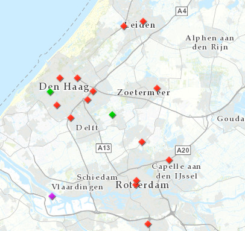

# CO2-emissies industrie 2013

Deze dataset bevat gegevens over de bestaande bronnen die warmte leveren aan warmtenetten naar brontype. De gegevens zijn overgenomen uit de Warmte Transitie Atlas samengesteld door adviebureau Over Morgen in opdracht van de provincie Zuid-Holland. Het is onduidelijk wat de herkomst van de gegevens is.

**Jaar:** Onbekend

**Dekking:** Zuid-Holland

**Projectie:** Amersfoort RD New EPSG:28992

**Bron Url:** 
* (Warmte Transitie Atlas)[https://warmtetransitieatlas.zuid-holland.nl/webappbuilder/apps/496/]
* (ArcGIS Server Feature Service service van Over Morgen)[https://services5.arcgis.com/PZYGbbhVncO1YI8q/arcgis/rest/services/WTA_PZH_Warmtebronnen/FeatureServer]
* (WFS van Over Morgen)[https://dservices5.arcgis.com/PZYGbbhVncO1YI8q/arcgis/services/PZH_WTA_Warmtebronnen_WFS/WFSServer?service=wfs&request=getcapabilities]

## Attributen

Het bestand bevat de volgende attributen:

| Attribuut          | Voorbeeld | Beschrijving | 
|----------         |-----------|--------------|
|OBJECTID | 1  | Uniek identificatienummer |
|Naam          |  WKC Stevenshof | Naam |
|Categorie          |  Hulpbron | Categorie: Hoofdbron of Hulpbron |
|Brontype          |  WKK | Brontype: WKK, AVI of Geothermie |

## Feature class in PI sandbox

De dataset is als feature class `Bestaande_warmtebronnen` terug te vinden in de PI sandbox database.
