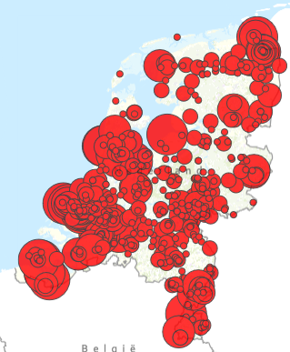

# CO2-emissies industrie 2013

Deze dataset bevat gegevens over de restwarmtepotentie op basis van CO2-emissies en SBI-codes. De dataset is overgenomen uit de [Warmte Transitie Atlas](https://warmtetransitieatlas.zuid-holland.nl/webappbuilder/apps/496/) samengesteld door adviesbureau Over Morgen in opdracht van de provincie Zuid-Holland. Volgens de metadata zijn de gegevens afkomstig van Rijksdienst voor Ondernemend Nederland (RVO). De RVO heeft de dataset samengesteld op basis van emissiegegevens van Nederlandse Emissieautoriteit en de E-MJV-gegevens. De dataset is een deelverzameling van de bron. De dataset bevat enkel locaties die in 2013 een selectie hadden groter dan 0, en van de dubbelingen is de locatie met de maximale waarde voor TJ reswarmte geselecteerd.

**Jaar:** 2013

**Dekking:** Nederland

**Projectie:** Amersfoort RD New EPSG:28992

**Bron Url:** 
* [Warmte Transitie Atlas](https://warmtetransitieatlas.zuid-holland.nl/webappbuilder/apps/496/)
* [ArcGIS Server Feature Service service van Over Morgen](https://services5.arcgis.com/PZYGbbhVncO1YI8q/arcgis/rest/services/restwarmte_potentie_rvo_20160203/FeatureServer)

## Attributen

Het bestand bevat de volgende attributen:

| Attribuut          | Voorbeeld | Beschrijving | 
|----------         |-----------|--------------|
|OBJECTID | 1  | Uniek identificatienummer |
|bedrijf          |  Reststoffen Energie Centrale (REC) | Bedrijf |
|FIRST_sbi_code   |  38.210 | SBI-code | 
|FIRST_sbi    |  Behandeling van onschadelijk afval | SBI |
|FIRST_doelgroep    |  Afvalverwijdering | Doelgroep |
|FIRST_subdoelgr    |  AVI's | Subdoelgroep |
|MAX_kgco2_2013    |  286.231.000 | CO2-uitstoot 2013 (kg) |
|MAX_tj_warmte    |  4.535 | Warmteverbruik 2013 (TJ) |
|ORIG_FID    |  1 | Geen beschrijving beschikbaar |

## Feature class in PI sandbox

De dataset is als feature class `CO2_emissies_industrie_2013` terug te vinden in de PI sandbox database.
