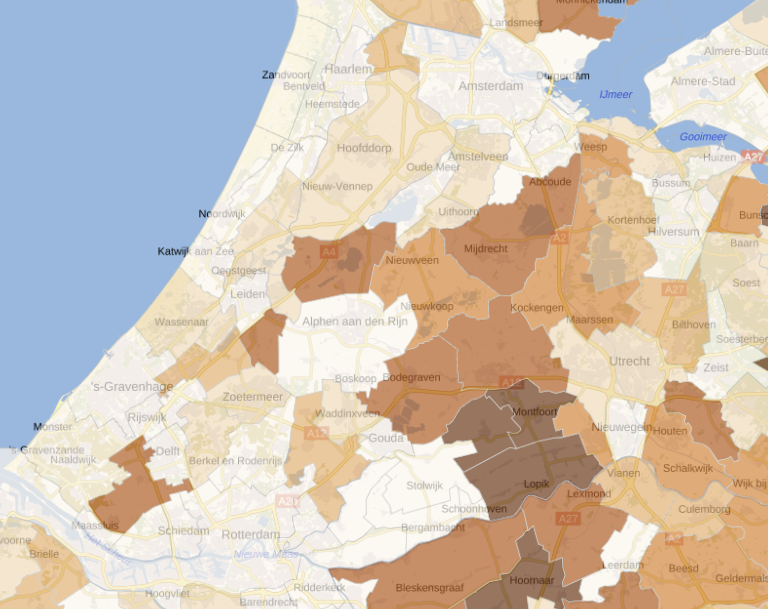

# Bio Reststromen - Duurzaam Energie Potentieel

De WarmteAtlas Nederland is een digitale, geografische kaart waarop warmteaanbod en -vraag in ons land zijn aangegeven. Aan de aanbodkant gaat het om (potentieel) geschikte locaties van warmte- en koude opslag (WKO), diepe geothermie, biomassa en restwarmte. Deze lagen tonen de potentie voor biomassa per gemeente.

**Aggregatie:** per gemeente

**Jaar:** 2015??

**Dekking:** Nederland

**Bron Url:** http://rvo.b3p.nl/viewer/app/Warmteatlas/v2

## Beschikbare lagen:

* Potentieel biogas totaal
* [Potentieel biogas GFT-afval](#GFT-kaart)
* [Potentieel biogas reststromen akkerbouw](#Akker-en-Grasland-kaart)
* [Potentieel biogas vloeibare mest](#mestkaart)
* Potentieel houtachtige biomassa bos
* Totaal potentieel houtachtige biomassa

Beschrijving biogas data : http://energiewiki.tiddlyspot.com/#Biogas
Beschrijving hout data: http://energiewiki.tiddlyspot.com/#Hout

### GFT kaart
Deze kaart presenteert de hoeveelheid biogas uit Groente, Fruit en Tuin afval uitgedrukt in GJ per hectare land voor elke gemeente; 
Voor de conversie is gebruik gemaakt van (Vereniging Afvalbedrijven (2009)) 

    BG_GFT_OPP = [100 (Nm3 biogas )/(ton GFT) * 60% (aandeel methaan in biogas) * 0.036 GJ/(Nm3 methaan)]/ (ha land)

De gegevens over Groente, Fruit en Tuinafval worden verzameld door het CBS, en zijn terug te vinden in CBSStatline.

### Akker en Grasland kaart

De kaart presenteert Bio Restfractie van akkerbouw en grasland in GJ per hectare land voor elke gemeente.
In onderstaande figuur (Muylaert, Koenraad and Sanders, Johan (2010)) zijn de akkerbouw gewassen ingedeeld in verschillende componenten. Alleen de Bio Restcomponent is verwerkt en opgezet in de biogas potentie kaart van akkerbouw en grasland. De andere componenten kunnen beter ingezet worden voor andere zaken, zoals voedsel.

Voor de potentie kaart is deze Bio Rest component voor ieder gewas vermenigvuldigd met het akkerbouw areaal van dit gewas (CBS gegevens), daarna is deze totale beschikbaar energie voor alle gewassen opgetelt en vervolgens gedeelt door het totale oppervlakte land van de gemeente. Dit resulteert dus in een Bio Rest in GJ per hectare land voor elke gemeente.

### Mestkaart

De mestkaart presenteert de hoeveelheid biogas uit vloeibare mest uitgedrukt in GJ per hectare land voor elke gemeente; 

Mestvolume gevens per gemeente (CBS statline) zijn hiervoor omgerekend naar GJ per hectare land voor elke gemeente met onderstaande formule:

    BG_MEST_OPP = [30 (Nm3 biogas )/(ton mest) * 60% (aandeel methaan in biogas) * 0.036 GJ/(Nm3 methaan)]/ (ha land)

## Houtachtige biomassa uit Bos per hectare land per jaar

Er is ongeveer 0.01 GJ/(ha.jaar) aan resthout beschikbaar uit Bos [ (2007)]. Dit is vermenigvuldigd met het aandeel Bos areaal per gemeente en gedeeld door het totale land areaal van de gemeente.

    HT_BOS_OPP GJ/(ha_land.jaar) = 0.01 GJ/(ha_bos.jaar) * (ha_Bos) / (ha_land gemeente)

Bron: (2007). Biomassa voor energie uit de nederlandse natuur. Technical report, WUR Wageningen Universiteit.

## 
Potentieel Houtachtige Biomassa uit Bos per oppervlakte land per gemeente in GJ/(ha.jaar)

## Download op nationaal georegister

http://www.nationaalgeoregister.nl/geonetwork/srv/dut/catalog.search#/metadata/34dacd72-d2fb-4e28-844d-73d3b9c3fef2
http://www.nationaalgeoregister.nl/geonetwork/srv/dut/catalog.search#/metadata/40f04047-3b61-40eb-b026-c1a0caa71881

## Services

### WMS 

http://geodata.nationaalgeoregister.nl/reststromen/wms?request=GetCapabilities

### WFS 

http://geodata.nationaalgeoregister.nl/reststromen/wfs?request=GetCapabilities

