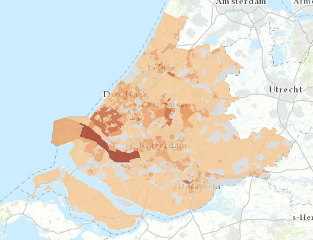

# Energieverbruik in 2014 per buurt (CBS)

Deze dataset bevat gegevens over het energieverbruik in 2014 in de provincie Zuid-Holland per buurt. 
De dataset is overgenomen uit de [Warmte Transitie Atlas](https://warmtetransitieatlas.zuid-holland.nl/webappbuilder/apps/496/) samengesteld door adviesbureau Over Morgen in opdracht van de provincie Zuid-Holland. 
De gegevens zijn afkomstig van het CBS.

**Jaar:** 2014

**Dekking:** Zuid-Holland

**Projectie:** Amersfoort RD New EPSG:28992

**Bron Url:** 
* [Warmte Transitie Atlas](https://warmtetransitieatlas.zuid-holland.nl/webappbuilder/apps/496/)
* [ArcGIS feature service van Over Morgen](https://services5.arcgis.com/PZYGbbhVncO1YI8q/arcgis/rest/services/PZH_WTA_Energieverbruik/FeatureServer)

## Attributen

Het bestand bevat de volgende attributen:

| Attribuut          | Voorbeeld | Beschrijving | 
|----------         |-----------|--------------|
|OBJECTID | 2  | Uniek identificatienummer |
|BU_CODE |BU04820102 | Buurtcode|
|BU_NAAM |Redersbuurt| Buurtnaam|
|WK_CODE |WK048201| Wijkcode|
|GM_CODE |GM0482| Gemeentecode|
|GM_NAAM |Alblasserdam| Gemeentenaam|
|G_W_gem |1160| Gemiddeld woninggasverbruik (m3)|
|G_W_som |270900| Totaal woninggasverbruik (m3)|
|G_W_N |234| Aantal berekende woningen voor aardgas|
|E_W_gem |2480| Gemiddeld woningelektraverbruik (kWh)|
|E_W_som |904200| Totaal woningelektraverbruik (kWh)|
|E_W_N |364| Aantal berekende woningen voor elektra|
|G_B_gem |3270| Gemiddeld bedrijfgasverbruik (m3)|
|G_B_som |147100| Totaal bedrijfgasverbruik (m3)|
|G_B_N |40| Aantal berekende bedrijven voor aardgas|
|E_B_gem |33050| Gemiddeld bedrijfelektraverbruik (kWh)|
|E_B_som |2709700| Totaal bedeijfelektraverbruik (kWh)|
|E_B_N |77| Aantal berekende bedrijven voor elektra|
|Opp_ha|9.79595611149457| Oppervlakte (ha)|
|Provincienaam |Zuid-Holland| Provincienaam|

## Feature class in PI sandbox

De dataset is als feature class `Energieverbruik_CBS_2014_buurt` terug te vinden in de PI sandbox database.
