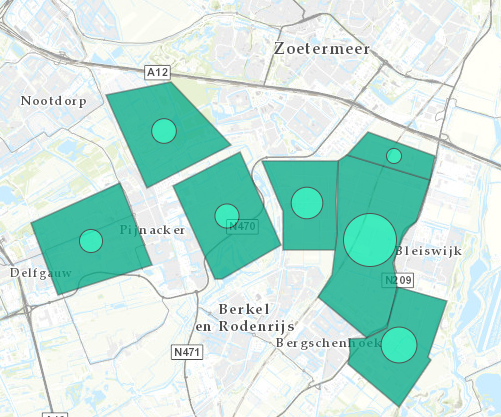

# Glasclusters warmtevraag

Deze dataset bevat gegevens van glasclusters in West- en Oostland in Zuid-Holland. Het betreft de warmtevraag in PJ. De gegevens zijn samengesteld op basis van onderzoek van Grontmij, Bureau Bloc (Oostland) en gemeente Westland (Westland). 
De dataset is overgenomen uit de [Warmte Transitie Atlas](https://warmtetransitieatlas.zuid-holland.nl/webappbuilder/apps/496/) samengesteld door adviesbureau Over Morgen in opdracht van de provincie Zuid-Holland. 

**Jaar:** 2016

**Dekking:** West- en Oostland, Zuid-Holland

**Projectie:** Amersfoort RD New EPSG:28992

**Bron Url:** 
* [Warmte Transitie Atlas](https://warmtetransitieatlas.zuid-holland.nl/webappbuilder/apps/496/)
* [ArcGIS feature service van Over Morgen](https://services5.arcgis.com/PZYGbbhVncO1YI8q/arcgis/rest/services/Glasclusters_warmtevraag_Zuid_Holland/FeatureServer)

## Attributen

Het bestand bevat de volgende attributen:

| Attribuut          | Voorbeeld | Beschrijving | 
|----------         |-----------|--------------|
|OBJECTID | 1 | Uniek identificatienummer |
|aantal_BAG_glastuinbouwbedrijve | 163| |
|areaal_ha_gedocumenteerd |225|  |
|warmtevraag_PJ |1.41|  |
|warmtebehoefte_in_basislast_MW |47|  |
|CO2_behoefte_ton_per_jaar |60038| |
|Clustergebied |Westland| |
|Cluster |W-11|  |

## Feature class in PI sandbox

De dataset is als feature class `Glasclusters_warmtevraag` terug te vinden in de PI sandbox database.
