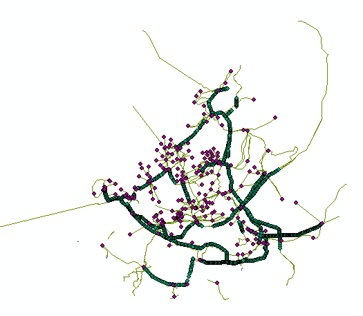

# Hoogspanningsnet

Gegevens van het hoogspanningsnet (masten, terreinen, knooppunten, verbindingen en stations) van de website http://www.hoogspanningsnet.com binnen de provincie Zuid-Holland. De dataset wordt actueel gehouden door een groep vrijwilligers.

**Jaar:** Actueel

**Dekking:** Zuid-Holland

**Projectie:** Amersfoort RD New EPSG:28992

**Bron Url:** 
* [HoogspanningsNet Netkaart](https://webkaart.hoogspanningsnet.com/index2.php#6/52.000/5.000)

# Layers

De dataset bevat de volgende lagen:
* Hoogspanningsnet_masten
* Hoogspanningsnet_terreinen
* Hoogspanningsnet_knooppunten
* Hoogspanningsnet_verbindingen
* Hoogspanningsnet_stations

## Attributen

Hoogspanningsnet_masten:

| Attribuut          | Voorbeeld | Beschrijving | 
|----------         |-----------|--------------|
|Hoofdtype || Hoofdtype |
|ID        || Uniek identificatienummer |
|Beheerder||Beheerder|
|Benutting||Benutting|
|Bouwwijze||Bouwwijze|
|In_dienst|| In dienst|
|Land||Land|
|Mastfunctie||Mastfunctie|
|Masthoogte||Masthoogte|
|Mastmodel||Mastmodel|
|Mastnummer||Mastnummer|
|Naam||Naam|
|Spanning||Spanning|
|Subtype||Subtype|
|Verbinding||Verbinding|
|Opmerkingen||Opmerkingen|
|Foto||Hyperlink naar de foto|
|Circuits||Circuits|

## Feature class in PI sandbox

De lagen in de dataset zijn als feature classes terug te vinden in de PI sandbox database.
