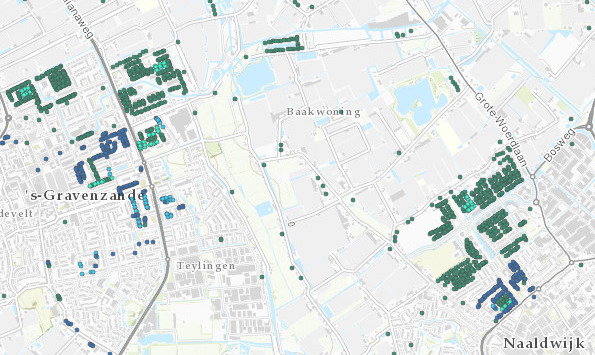

# Kansrijke panden voor all electric

Deze dataset bevat gegevens van kansrijke gebouwen voor all electric in Provincie Zuid-Holland
De dataset is overgenomen uit de [Warmte Transitie Atlas](https://warmtetransitieatlas.zuid-holland.nl/webappbuilder/apps/496/) samengesteld door adviesbureau Over Morgen in opdracht van de provincie Zuid-Holland. 
Het is onbekend wat de bron is van de gegevens.

**Jaar:**onbekend 2014

**Dekking:** Zuid-Holland

**Projectie:** Amersfoort RD New EPSG:28992

**Bron Url:** 
* [Warmte Transitie Atlas](https://warmtetransitieatlas.zuid-holland.nl/webappbuilder/apps/496/)
* [ArcGIS feature service van Over Morgen](https://services5.arcgis.com/PZYGbbhVncO1YI8q/arcgis/rest/services/PZH_WTA_Kansen_allelectric/FeatureServer)

## Attributen

Het bestand bevat de volgende attributen:

| Attribuut          | Voorbeeld | Beschrijving | 
|----------         |-----------|--------------|
|OBJECTID |1| Uniek identificatienummer |
|XCoord |104150.714489872| X-coördinaat|
|YCoord |430876.409219092| Y-coördinaat|
|Identificatie |0482100001243714| Identificatie|
|Bouwjaar |2005| Bouwjaar|
|Opp_taal |181| Oppervlakte (m2)|
|Gebruiksfunctie |woonfunctie| Gebruiksfunctie|
|Pandtype |Vrijstaande woning| Pandtype|
|pand_epi |3.03| Energieindex|
|pand_labelCombi |G| Energielabel|
|SJV_gas_m3_PC6_min |1498| Kleinverbruik aardgas (m3)|
|Indicatie_Blokverwarming || Indicatie_Blokverwarming|
|Corporatiebezit |Geen corporatiebezit| Corporatiebezit|
|Count_wocowoningen |1| Aantal corporatiewoningen|
|Kanscat_HT_warmtenet || Kansrijke panden warmtenet|
|Kanscat_AllElectric |Kansrijke woningen voor All Electric (lage investering), particulier bezit| Kansrijke panden all electric|
|Kanscat_HT_warmtenet_WEQ || Kansrijke WEQ warmtenet|
|Kanscat_AllElectric_WEQ |1| Kansrijke WEQ all electric|

Let op: Indicatie_Blokverwarming, Kanscat_HT_warmtenet en Kanscat_HT_warmtenet_WEQ zijn altijd `NULL`.

## Feature class in PI sandbox

De dataset is als feature class `Kansrijke_panden_voor_all_electric` terug te vinden in de PI sandbox database.
