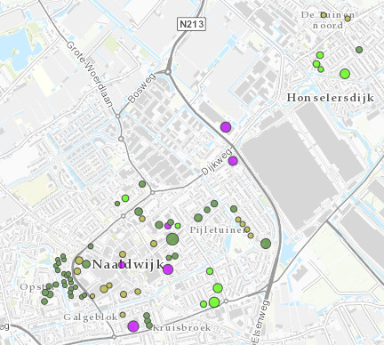

# Kansrijke panden voor warmtenet

Deze dataset bevat gegevens van kansrijke panden voor aansluiting op een warmtenet in de Provincie Zuid-Holland.
De dataset is overgenomen uit de [Warmte Transitie Atlas](https://warmtetransitieatlas.zuid-holland.nl/webappbuilder/apps/496/) samengesteld door adviesbureau Over Morgen in opdracht van de provincie Zuid-Holland. 
Het is onbekend wat de bron is van de gegevens.

**Jaar:** onbekend

**Dekking:** Zuid-Holland

**Projectie:** Amersfoort RD New EPSG:28992

**Bron Url:** 
* [Warmte Transitie Atlas](https://warmtetransitieatlas.zuid-holland.nl/webappbuilder/apps/496/)
* [ArcGIS feature service van Over Morgen](https://services5.arcgis.com/PZYGbbhVncO1YI8q/arcgis/rest/services/PZH_WTA_Kansen_warmtenet/FeatureServer)

## Attributen

Het bestand bevat de volgende attributen:

| Attribuut          | Voorbeeld | Beschrijving | 
|----------         |-----------|--------------|
|OBJECTID |1| Uniek identificatienummer |
|XCoord |104749.570663476| X-coördinaat|
|YCoord |430795.952308985| Y-coördinaat|
|Identificatie |0482100001243549| Identificatie|
|Bouwjaar |1971| Bouwjaar|
|Opp_taal |10763| Oppervlakte (m2)|
|Gebruiksfunctie |utiliteitsfunctie| Gebruiksfunctie|
|Pandtype |Utiliteitsbouw| Pandtype|
|pand_epi |1.0265| Energieindex|
|pand_labelCombi |A| Energielabel|
|SJV_gas_m3_PC6_min |255| Kleinverbruik aardgas (m3)|
|Indicatie_Blokverwarming |Mogelijk blokverwarming| Indicatie_Blokverwarming|
|Corporatiebezit |Geen corporatiebezit| Corporatiebezit|
|Count_wocowoningen || Aantal corporatiewoningen|
|Kanscat_HT_warmtenet |Utiliteitsbouw, kansrijk voor warmtenet| Kansrijke panden warmtenet|
|Kanscat_AllElectric || Kansrijke panden all electric|
|Kanscat_HT_warmtenet_WEQ |108| Kansrijke WEQ warmtenet|
|Kanscat_AllElectric_WEQ || Kansrijke WEQ all electric|

Let op: Kanscat_AllElectric en Kanscat_AllElectric_WEQ zijn altijd `NULL`.

## Feature class in PI sandbox

De dataset is als feature class `Kansrijke_panden_voor_warmtenet` terug te vinden in de PI sandbox database.
