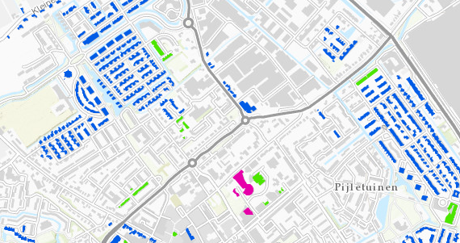

# Kansrijke postcodes voor basismaatregelen (no regret)

Deze dataset bevat gegevens van kansrijke postcodes voor no regretmaatregelen in de warmtetransitie in Zuid-Holland. De maatregelen zijn uitgesplitst naar investering, koop-huur en huishoudeninkomen.
De dataset is overgenomen uit de [Warmte Transitie Atlas](https://warmtetransitieatlas.zuid-holland.nl/webappbuilder/apps/496/) samengesteld door adviesbureau Over Morgen in opdracht van de provincie Zuid-Holland. 
Het is onbekend wat de bron is van de gegevens.

**Jaar:** onbekend

**Dekking:** Zuid-Holland

**Projectie:** Amersfoort RD New EPSG:28992

**Bron Url:** 
* [Warmte Transitie Atlas](https://warmtetransitieatlas.zuid-holland.nl/webappbuilder/apps/496/)
* [ArcGIS feature service van Over Morgen](https://services5.arcgis.com/PZYGbbhVncO1YI8q/arcgis/rest/services/postcodes_noregret_clip_select_26031/FeatureServer)

## Attributen

Het bestand bevat de volgende attributen:

| Attribuut          | Voorbeeld | Beschrijving | 
|----------         |-----------|--------------|
|OBJECTID |1| Uniek identificatienummer |
|woon_count |26| Aantal woningen|
|Inv_deg70_eur_pnd_v |110000|| 
|Inv_deg70_eur_pnd_t |210000|| 
|Gv_norm_m3_pnd |35036|| 
|Besp_deg70_GJ_pnd_v |132.12|| 
|Besp_deg70_GJ_pnd_t |192.87|| 
|Ort_deg70_eur_pnd_v |33692|| 
|Ort_deg70_eur_pnd_t |98603|| 
|Postcode |2159LK| Postcode|
|INW_014 |20||
|INW_1524 |5||
|INW_2544 |20||
|INW_4564 |15||
|INW_65PL |5||
|P_HUURWON |50||
|P_KOOPWON |50||
|WON_HCORP |10||
|M_INKHH |Midden tot boven midden||
|UITKMINAOW |5|| 
|Inv_deg70_eur_pnd_gem |6154| Investering no regretmaatregelen (€/woning) (gem)|
|Inv_deg70_eur_pnd_str |€4000 tot €8000| Investering no regretmaatregelen (€/woning)|
|Ort_deg70_eur_pnd_gem |2544| Onrendabele top no regretmaatregelen (€/woning) (gem)|
|Ort_deg70_eur_pnd_str |€1000 tot €4000| Onrendabele top no regretmaatregelen (€/woning)|
|Besp_deg70_GJ_pnd_gem |6.24980769230769| Energiebesparing bij no regretmaatregelen (GJ/woning) (gem)|
|Besp_deg70_GJ_pnd_str |1296 GJ tot 3792 GJ| Energiebesparing bij no regretmaatregelen (GJ/woning)|
|Kanscategorie_noregret |Onrendabele top maximaal €6.000, overwegend koopwoningen, gemiddeld en bovengemiddeld inkomen| Kanscategorie no-regretmaatregelen|

## Feature class in PI sandbox

De dataset is als feature class `Kansrijke_panden_voor_all_electric` terug te vinden in de PI sandbox database.
