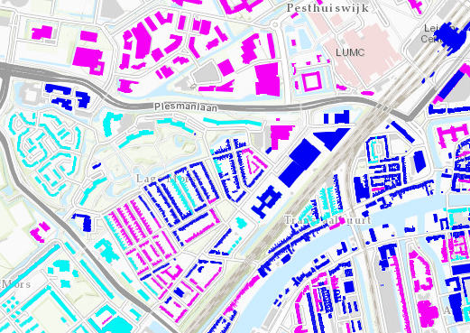

# Ouderdom gasleidingen Liander

Deze dataset bevat gegevens over de ouderdom van gasleidingen van Liander. 
De dataset is overgenomen uit de [Warmte Transitie Atlas](https://warmtetransitieatlas.zuid-holland.nl/webappbuilder/apps/496/) samengesteld door adviesbureau Over Morgen in opdracht van de provincie Zuid-Holland. 
Het is onduidelijk wat de herkomst is van de gegevens.

**Jaar:** Onbekend

**Dekking:** Nederland

**Projectie:** Amersfoort RD New EPSG:28992

**Bron Url:** 
* [Warmte Transitie Atlas](https://warmtetransitieatlas.zuid-holland.nl/webappbuilder/apps/496/)
* [ArcGIS feature service](https://services1.arcgis.com/v6W5HAVrpgSg3vts/ArcGIS/rest/services/OuderdomHoofdleidingen_WFL1/FeatureServer)

## Attributen

Het bestand bevat de volgende attributen:

| Attribuut          | Voorbeeld | Beschrijving | 
|----------         |-----------|--------------|
|OBJECTID_1 | 1  | Uniek identificatienummer |
|PAND_ID | 15856806  | Pand ID |
|POSTCODE | 2333CC  | Uniek identificatienummer |
|GEWOGEN_GEMIDDELDE_CATEGORIE  | 	2.35  | Gewogen gemiddelde categorie (x). 1 ≤ x ≤ 1.67: Overwegend oudere leidingen. 1.67 < x ≤ 2.34: Gemiddelde leeftijd, 2.34 < x ≤ 3: Overwegend nieuwe leidingen. |

## Feature class in PI sandbox

De dataset is als feature class `Ouderdom_gasleidingen_Liander` terug te vinden in de PI sandbox database.
