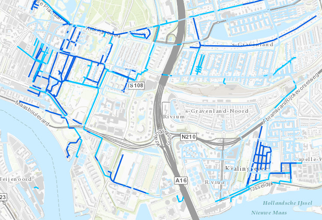

# Ouderdom gasleidingen Stedin

Deze dataset bevat gegevens over de ouderdom van gasleidingen van Stedin. 
De dataset is overgenomen uit de [Warmte Transitie Atlas](https://warmtetransitieatlas.zuid-holland.nl/webappbuilder/apps/496/) samengesteld door adviesbureau Over Morgen in opdracht van de provincie Zuid-Holland. 
Het is onduidelijk wat de herkomst is van de gegevens.

**Jaar:** Onbekend

**Dekking:** Nederland

**Projectie:** Amersfoort RD New EPSG:28992

**Bron Url:** 
* [Warmte Transitie Atlas](https://warmtetransitieatlas.zuid-holland.nl/webappbuilder/apps/496/)
* [ArcGIS feature service](https://services3.arcgis.com/PeOi6aWiQVQNdaI8/arcgis/rest/services/KM_Gasvervangingsdata/FeatureServer)

## Attributen

Het bestand bevat de volgende attributen:

| Attribuut          | Voorbeeld | Beschrijving | 
|----------         |-----------|--------------|
|OBJECTID | 1  | Uniek identificatienummer |
|Status         |  Leeftijd leiding: ouder dan 30 jaar | Leeftijd leiding: jonger of gelijk aan 30 jaar, of ouder dan 30 jaar  |

## Feature class in PI sandbox

De dataset is als feature class `Ouderdom_gasleidingen_Stedin` terug te vinden in de PI sandbox database.
