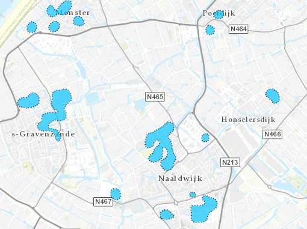

# Potentie-eiland all electric

Deze dataset bevat gegevens van van potentie-eilanden voorall electric in de Provincie Zuid-Holland.
De dataset is overgenomen uit de [Warmte Transitie Atlas](https://warmtetransitieatlas.zuid-holland.nl/webappbuilder/apps/496/) samengesteld door adviesbureau Over Morgen in opdracht van de provincie Zuid-Holland. 
Het is onbekend wat de bron is van de gegevens.

**Jaar:** onbekend

**Dekking:** Zuid-Holland

**Projectie:** Amersfoort RD New EPSG:28992

**Bron Url:** 
* [Warmte Transitie Atlas](https://warmtetransitieatlas.zuid-holland.nl/webappbuilder/apps/496/)
* [ArcGIS feature service van Over Morgen](https://services5.arcgis.com/PZYGbbhVncO1YI8q/arcgis/rest/services/PZH_WTA_Potentie_eilanden_metKosten/FeatureServer)

## Attributen

Het bestand bevat de volgende attributen:

| Attribuut          | Voorbeeld | Beschrijving | 
|----------         |-----------|--------------|
|OBJECTID |1| Uniek identificatienummer |
|Join_Count|	93||
|TARGET_FID|	9||
|Inv_deg55_eur_pnd_v|465000||
|Inv_deg55_eur_pnd_t|915000| |
|Ort_deg55_eur_pnd_v|278492| |
|Ort_deg55_eur_pnd_t|557369| |
|Inv_ae_eur_pnd_v|217000| |
|Inv_ae_eur_pnd_t|647500| |
|Inv_t_ae_eur_pnd_v|682000| |
|Inv_t_ae_eur_pnd_t|1562500| |
|Ort_t_ae_eur_pnd_v|284644| |
|Ort_t_ae_eur_pnd_t|744422| |
|Woningequivalenten|84| Totaal WEQ|
|woon_count|43| Aantal woningen|
|Count_wocowoningen|36| Aantal corporatiewoningen|
|Kanscat_AllElectric_WEQ|30| Kansrijke WEQ all electric|
|Inv_deg55_eur_won_str|€11000 tot €21000| Investering vergaande maatregelen (€/woning)|
|Ort_deg55_eur_won_str|€6000 tot €13000| Onrendabele top vergaande maatregelen (€/woning)|
|Inv_ae_eur_won_str|€5000 tot €15000| Investering all electric (€/woning)|
|Inv_t_ae_eur_won_str|€16000 tot €36000| Investering vergaande maatregelen en all electric (€/woning)|
|Ort_t_ae_eur_won_str|€7000 tot €17000| Onrendabele top vergaande maatregelen en all electric (€/woning)|

## Feature class in PI sandbox

De dataset is als feature class `Potentie_eiland_all_electric` terug te vinden in de PI sandbox database.
