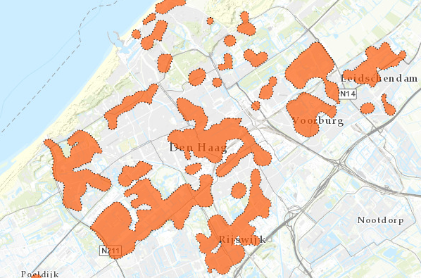

# Potentie-eiland warmtenet

Deze dataset bevat gegevens van van potentie-eilanden voor warmtenetten in de Provincie Zuid-Holland.
De dataset is overgenomen uit de [Warmte Transitie Atlas](https://warmtetransitieatlas.zuid-holland.nl/webappbuilder/apps/496/) samengesteld door adviesbureau Over Morgen in opdracht van de provincie Zuid-Holland. 
Het is onbekend wat de bron is van de gegevens.

**Jaar:** onbekend

**Dekking:** Zuid-Holland

**Projectie:** Amersfoort RD New EPSG:28992

**Bron Url:** 
* [Warmte Transitie Atlas](https://warmtetransitieatlas.zuid-holland.nl/webappbuilder/apps/496/)
* [ArcGIS feature service van Over Morgen](https://services5.arcgis.com/PZYGbbhVncO1YI8q/arcgis/rest/services/PZH_WTA_Potentie_eilanden_metKosten/FeatureServer)

## Attributen

Het bestand bevat de volgende attributen:

| Attribuut          | Voorbeeld | Beschrijving | 
|----------         |-----------|--------------|
|OBJECTID |2| Uniek identificatienummer |
|Join_Count|229||
|TARGET_FID|7||
|Woningequivalenten |1020| Totaal WEQ|
|Inv_deg70_eur_pnd_v |3575000||
|Inv_deg70_eur_pnd_t |7136000||
|Ort_deg70_eur_pnd_v |1369852||
|Ort_deg70_eur_pnd_t |4128673||
|Inv_warmte_eur_pnd_v |5211000||
|Inv_warmte_eur_pnd_t |8481000||
|Inv_t_warmte_eur_pnd_v |9538500||
|Inv_t_warmte_eur_pnd_t |15617000||
|Ort_t_warmte_eur_pnd_v |7333352||
|Ort_t_warmte_eur_pnd_t |12609673||
|woon_count |827| Aantal woningen|
|Count_wocowoningen |673| Aantal corporatiewoningen|
|Kanscat_HT_warmtenet_WEQ |561| Kansrijke WEQ voor warmtenet|
|Inv_deg70_eur_won_str |€4000 tot €9000| Investering basismaatregelen (€/woning)|
|Ort_deg70_eur_won_str |€2000 tot €5000| Onrendabele top basismaatregelen (€/woning)|
|Inv_warmte_eur_won_str |€6000 tot €10000| Investering warmtenet (€/woning)|
|Inv_t_warmte_eur_won_str |€12000 tot €19000| Investering basismaatregelen en warmtenet (€/woning)|
|Ort_t_warmte_eur_won_str |€9000 tot €15000| Onrendabele top basismaatregelen en warmtenet (€/woning)|

## Feature class in PI sandbox

De dataset is als feature class `Potentie_eiland_warmtenet` terug te vinden in de PI sandbox database.
