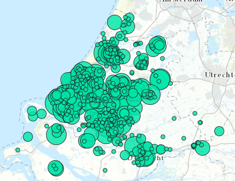

# Vergunde WKO systemen 2017

Deze dataset bevat gegevens over vergunningen voor warmte-koudeopslag tot en met 1 juli 2017. De gegevens zijn overgenomen uit de WFS van de provincie Zuid-Holland. Ze zijn afkomstig uit het Landelijk Grondwater Register.

**Jaar:** 2017

**Dekking:** Nederland

**Projectie:** Amersfoort RD New EPSG:28992

**Bron Url:** 
* [Warmte Transitie Atlas](https://warmtetransitieatlas.zuid-holland.nl/webappbuilder/apps/496/)
* [ArcGIS Server Map Server van de provincie Zuid-Holland](https://geoservices.zuid-holland.nl/arcgis/rest/services/Milieu/Milieu_WKO/MapServer)
* [WFS van de provincie Zuid-Holland](https://geoservices.zuid-holland.nl/arcgis/rest/services/Milieu/Milieu_WKO_WFS/MapServer)

## Attributen

Het bestand bevat de volgende attributen:

| Attribuut          | Voorbeeld | Beschrijving | 
|----------         |-----------|--------------|
|OBJECTID | 1  | Uniek identificatienummer |
|Locatie | Woningproject Weideveld-Zuid | Locatie |
|Straat | ten oosten van de Broekveldselaan | Straat |
|Plaats | Bodegraven | Plaats |
|Besluitnr | PZH-2010-196867615 | Besluitnummer |
Shape 
|X_coordinaat |  111965 |X-coördinaat |
|Y_coordinaat | 454103 |Y-coördinaat | 
|Vergund_m3_h | 110 | Vergund m3 per uur |
|Vergund_m3_jaar | 1110000 | Vergund m3 per jaar |
|WVP | 2 en 3 | Watervoerend pakket |
|LGR_inr_nr | 49796 |   |
|Datum_besluit | 8/26/2010 2:00 A.M. |Datum besluit |

## Feature class in PI sandbox

De dataset is als feature class `CO2_emissies_industrie_2013` terug te vinden in de PI sandbox database.
