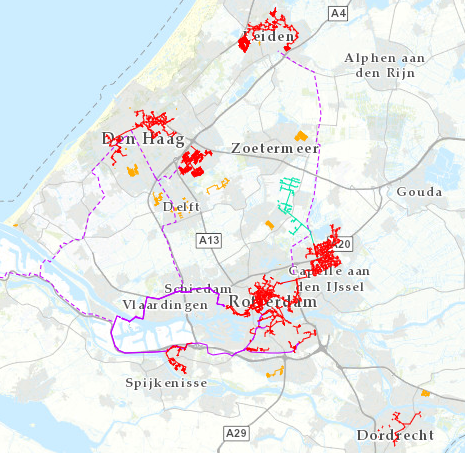

# Warmtenetten

Deze dataset bevat gegevens over bestaande en geplande warmteinfrastructuur in de provincie Zuid-Holland, uitgesplitst naar eigendom, bronttype en nettype. De dataset is overgenomen uit de [Warmte Transitie Atlas](https://warmtetransitieatlas.zuid-holland.nl/webappbuilder/apps/496/) samengesteld door adviesbureau Over Morgen in opdracht van de provincie Zuid-Holland. Het is onbekend wat de herkokmst is van de gegevens.

**Jaar:** onbekend

**Dekking:** Zuid-Holland

**Projectie:** Amersfoort RD New EPSG:28992

**Bron Url:** 
* [Warmte Transitie Atlas](https://warmtetransitieatlas.zuid-holland.nl/webappbuilder/apps/496/)
* [ArcGIS feature service van Over Morgen](https://services5.arcgis.com/PZYGbbhVncO1YI8q/arcgis/rest/services/PZH_WTA_Warmtenetten/FeatureServer)

## Attributen

Het bestand bevat de volgende attributen:

| Attribuut          | Voorbeeld | Beschrijving | 
|----------         |-----------|--------------|
|OBJECTID | 1  | Uniek identificatienummer |
|Netbeheerder |  Nuon | Netbeheerder |
|Nettype | Stadswarmtenet | Nettype |
|Warmterotonde | Geen Warmterotonde | Wel of geen warmterotonde |
|Status | Bestaand | Status |
|Netnaam | Leiden | Netnaam |
|Bronnen | WKC | Bronnen |

## Feature class in PI sandbox

De dataset is als feature class `Warmtenetten` terug te vinden in de PI sandbox database.
